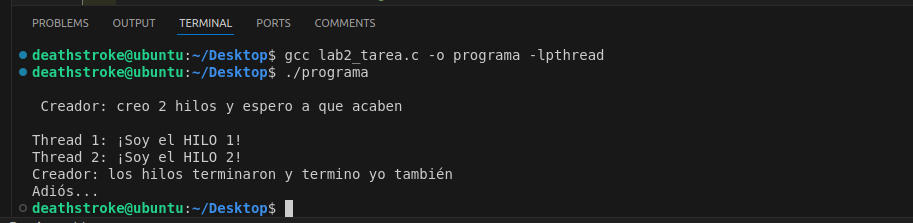
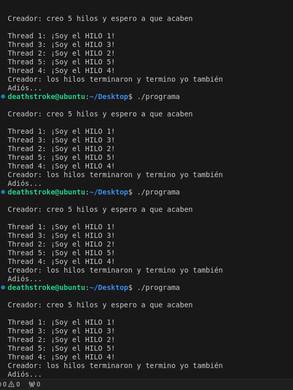

# Tecnologías de Automatización - Informe de Laboratorio 2

### Integrantes
- Rodrigo Willians Agurto Tumialan `20202021`
- Manuel Alejandro Pallete Figueroa `20191217`
---

### - A partir del código que se les proporciona, expliquen cómo funciona la creación de hilos.

```c
//Incluye librerías
#include <pthread.h> 
#include <stdio.h>   
#include <stdlib.h>  


/* Programa que demuestra el paso de argumentos en la creación de threads */


// Defino el arreglo de mensajes
char *mensaje[2];


// Función que ejecutarán los hilos
void *imprimir(void *threadid) {
    int *id_ptr, taskid;
    id_ptr = (int *) threadid; // Transforma el puntero de argumento a un puntero a entero
    taskid = *id_ptr; // Otorga el identificador de la tarea
    printf("Thread %d: %s\n", taskid, mensaje[taskid - 1]); // Imprime el mensaje correspondiente a su respectivo hilo
    pthread_exit(NULL); // Finaliza el hilo
}


int main() {
    // Definición las variables para los hilos
    pthread_t hilo1, hilo2; // Identificadores de cada uno de los hilos
    int *taskid1, *taskid2; // Punteros para los identificadores de las tareas
    int nombre[2] = {1, 2}; // Arreglo con los identificadores de las tareas
    pthread_attr_t attr; // Atributos para los hilos
    int rc; // Variable para códigos de retorno


    // Inicializo los mensajes con los siguientes arreglos
    mensaje[0] = "¡Soy el HILO 1!";
    mensaje[1] = "¡Soy el HILO 2!";


    // Imprimir el mensaje del creador de los hilos
    printf("\n Creador: creo 2 hilos y espero a que acaben\n\n");


    // Creo los atributos de los hilos
    pthread_attr_init(&attr); // Inicializa los atributos de los hilos
    pthread_attr_setdetachstate(&attr, PTHREAD_CREATE_JOINABLE); // Establece el estado de separación a "joinable"


    // Asigna valores a los identificadores de las tareas
    taskid1 = (int *) malloc(sizeof(int)); // Asigna memoria para el identificador de tarea 1
    *taskid1 = 1; // Asigna el valor 1 al identificador de la tarea 1
    taskid2 = (int *) malloc(sizeof(int)); // Asigna memoria para el identificador de tarea 2
    *taskid2 = 2; // Asigna el valor 2 al identificador de la tarea 2


    // Creo los hilos
    pthread_create(&hilo1, &attr, (void *)imprimir, (void *)taskid1); //hilo 1
    pthread_create(&hilo2, &attr, (void *)imprimir, (void *)taskid2); //hilo 2
   
    // Elimino los atributos del hilo
    pthread_attr_destroy(&attr); 


    // Espero que los hilos finalicen
    pthread_join(hilo1, NULL); // Que hilo 1 termine
    pthread_join(hilo2, NULL); // Que hilo 2 termine


    // Mensaje final 
    printf("Creador: los hilos terminaron y termino yo también\nAdiós...\n");


    // Finalizo 
    pthread_exit(NULL);
}
```
A continuación se muestra la compilación y ejecución del código anterior:



--- 
###  - Describir el uso de los punteros, el paso de argumentos y la impresión del identificador del hilo junto con el mensaje asignado

* Uso de punteros `*`
```c
int *taskid1, *taskid2;
```
Estos punteros se utilizan para almacenar los identificadores de las tareas que se pasarán a los hilos.

```c
taskid1 = (int *) malloc(sizeof(int));
taskid2 = (int *) malloc(sizeof(int));
```
Se asigna memoria para los punteros `taskid1` y `taskid2` para almacenar los identificadores de las tareas.

```c
*taskid1 = 1;
*taskid2 = 2;
```
Se asignan los valores 1 y 2 a los punteros `taskid1` y `taskid2`, respectivamente.

```c
pthread_create(&hilo1, &attr, (void *)imprimir, (void *)taskid1);
pthread_create(&hilo2, &attr, (void *)imprimir, (void *)taskid2);
```
Se crean los hilos `hilo1` y `hilo2` con los atributos `attr` y se les pasa la función `imprimir` con los punteros `taskid1` y `taskid2` como argumentos.


* Paso de argumentos
```c
void *imprimir(void *threadid)
```
La función `imprimir` recibe un puntero genérico `void *threadid` como argumento.

```c
int *id_ptr, taskid;
id_ptr = (int *) threadid;
taskid = *id_ptr;
```
Se convierte el puntero `threadid` a un puntero a entero `id_ptr` y se obtiene el identificador de la tarea `taskid`.

* Impresión del identificador del hilo junto con el mensaje asignado
```c
char *mensaje[2];
mensaje[0] = "¡Soy el HILO 1!";
mensaje[1] = "¡Soy el HILO 2!";
```
Se definen los mensajes que se imprimirán en los hilos.

```c
printf("Thread %d: %s\n", taskid, mensaje[taskid - 1]);
```
Se imprime el identificador del hilo y el mensaje correspondiente al hilo.

---
### Modificar el código para que se creen 5 hilos, cada uno con su propio identificador y mensaje.

```c
// Incluye librerías
#include <pthread.h> 
#include <stdio.h>   
#include <stdlib.h>  


// Defino el arreglo de mensajes
char *mensaje[5];

// Variables globales para controlar la sincronización
int turno = 1;  // Variable que indica el turno de impresión 
pthread_mutex_t mutex;  // Mutex para proteger el acceso a la variable "turno"
pthread_cond_t cond;    // Condicional para despertar a los hilos en orden

// Función que ejecutarán los hilos
void *imprimir(void *threadid) {
    int *id_ptr, taskid;
    id_ptr = (int *) threadid; // Transforma el puntero de argumento a un puntero a entero
    taskid = *id_ptr; // Otorga el identificador de la tarea

    // Control de sincronización para imprimir en el orden deseado
    pthread_mutex_lock(&mutex);  // Bloquea el mutex

    while (taskid != turno) {
        pthread_cond_wait(&cond, &mutex);  // Espera hasta que sea su turno
    }

    printf("Thread %d: %s\n", taskid, mensaje[taskid - 1]); // Imprime el mensaje correspondiente a su respectivo hilo

    // Actualiza el turno según el orden especificado: 1, 3, 2, 5, 4
    if (turno == 1) turno = 3;
    else if (turno == 3) turno = 2;
    else if (turno == 2) turno = 5;
    else if (turno == 5) turno = 4;
    else turno = 0;  // Finaliza

    pthread_cond_broadcast(&cond);  // Despierta a los otros hilos para que revisen si es su turno
    pthread_mutex_unlock(&mutex);  // Desbloquea el mutex

    pthread_exit(NULL); // Finaliza el hilo
}

int main() {
    // Definición las variables para los hilos
    pthread_t hilos[5]; // Identificadores de hilos
    int *taskid[5]; // Punteros para los identificadores de las tareas
    pthread_attr_t attr; // Atributos para los hilos
    int rc; // Variable para códigos de retorno

    // Inicializo los mensajes 
    mensaje[0] = "¡Soy el HILO 1!";
    mensaje[1] = "¡Soy el HILO 2!";
    mensaje[2] = "¡Soy el HILO 3!";
    mensaje[3] = "¡Soy el HILO 4!";
    mensaje[4] = "¡Soy el HILO 5!";

    // Inicialización del mutex y condicional
    pthread_mutex_init(&mutex, NULL);
    pthread_cond_init(&cond, NULL);

    // Imprimir el mensaje del creador de los hilos
    printf("\nCreador: creo 5 hilos y espero a que acaben\n\n");

    // Creo los atributos de los hilos
    pthread_attr_init(&attr); // Inicializa los atributos de los hilos
    pthread_attr_setdetachstate(&attr, PTHREAD_CREATE_JOINABLE); // Establece el estado de separación a "joinable"

    // Asigna valores a los identificadores de las tareas y crea los hilos
    for (int i = 0; i < 5; i++) {
        taskid[i] = (int *) malloc(sizeof(int)); // Asigna memoria para el identificador de tarea
        *taskid[i] = i + 1; // Asigna el valor al identificador 
        pthread_create(&hilos[i], &attr, (void *)imprimir, (void *)taskid[i]); // Crea el hilo
    }

    // Elimino los atributos del hilo
    pthread_attr_destroy(&attr);

    // Espera a que los hilos finalicen
    for (int i = 0; i < 5; i++) {
        pthread_join(hilos[i], NULL); // cada hilo termine
    }

    // Mensaje final 
    printf("Creador: los hilos terminaron y termino yo también\nAdiós...\n");

    // Destruye el mutex y la variable condicional
    pthread_mutex_destroy(&mutex);
    pthread_cond_destroy(&cond);

    // Termina
    pthread_exit(NULL);
}
```
A continuación se muestra la compilación y ejecución del código modificado:


Explicación del código modificado:

Primero se la siguiente declaración de variables globales:
```c
// Defino el arreglo de mensajes
char *mensaje[5];

// Variables globales para controlar la sincronización
int turno = 1;  // Variable que indica el turno de impresión de cada hilo
pthread_mutex_t mutex;  // Mutex para proteger el acceso a la variable "turno"
pthread_cond_t cond;    // Condicional para despertar a los hilos en orden
```
En este código se hace uso de un mutex (`pthread_mutex_t mutex`) y una variable condicional (`pthread_cond_t cond`) para gestionar el acceso a la variable global turno, la cual indica qué hilo debe imprimir su mensaje en cada momento.

Recordar que la función del mutex garantiza que cada uno delos hilos pueda acceder a una sección del código a la vez. Esto a finde evitar condiciones en donde dos o más hilos intentan acceder de manera siultánea a la misa sección. Lo que genera le impresión de los mensajes de manera desordenada e impredecible.

Dentro de la función imprimir es agregó el siguiente código:
```c
// Control de sincronización para imprimir en el orden deseado
    pthread_mutex_lock(&mutex);  // Bloquea el mutex

    while (taskid != turno) {
        pthread_cond_wait(&cond, &mutex);  // Espera hasta que sea su turno
    }

    printf("Thread %d: %s\n", taskid, mensaje[taskid - 1]); // Imprime el mensaje correspondiente a su respectivo hilo

    // Actualiza el turno según el orden especificado: 1, 3, 2, 5, 4
    if (turno == 1) turno = 3;
    else if (turno == 3) turno = 2;
    else if (turno == 2) turno = 5;
    else if (turno == 5) turno = 4;
    else turno = 0;  // Finalización

    pthread_cond_broadcast(&cond);  // Despierta a los otros hilos para que revisen si es su turno
    pthread_mutex_unlock(&mutex);  // Desbloquea el mutex
```
Con `pthread_mutex_lock(&mutex)` se bloquea el mutex para evitar que otros hilos accedan a la variable turno al mismo tiempo. Luego, se entra en un bucle while que espera hasta que el identificador de la tarea coincida con el valor de turno. Dentro del bucle, se llama a `pthread_cond_wait(&cond, &mutex)` para poner al hilo en espera hasta que sea su turno. Una vez que el hilo obtiene el turno, imprime su mensaje y actualiza el valor de turno según el orden especificado. Finalmente, se llama a `pthread_cond_broadcast(&cond)` para despertar a los otros hilos y se libera el mutex con `pthread_mutex_unlock(&mutex)`.

Notar que la variable turno juega un papel clave en el control del orden de ejecución. Solo el hilo cuyo identificador coincide con el valor de turno tiene permiso para imprimir, mientras que los demás hilos permanecen en espera hasta que llegue su turno.
